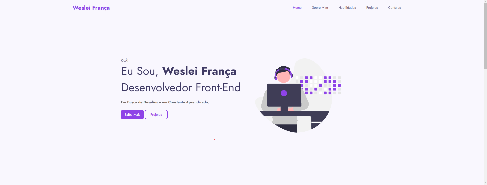

#Portifolio

<h1 align="center">
    
</h1>

<h4 align="center"> 
	🚧 Portifolio 🚀 em construção... 🚧
</h4>

## 💻 Sobre o projeto

Esse é o meu Portifolio, onde falo mais sobre mim e os meus projetos. Estou fazendo ele somente com HTML e CSS, estou para aprimora-lo e aceito dicas de como melhora-lo.

## 🎨 Layout

O layout será feito em quatro páginas sendo elas: Home, Sobre Mim, Meus Projetos e Contatos

### Sobre o Projeto

<h1>
    
</h1>

### O que falta ser feito

O que já foi feito:

- [x] Criação HTML
- [x] Criação CSS
- [ ] Criação JavaScript
- [ ] Reponsividade
- [ ] Meus Projetos e Contatos
- [ ] Colocar os links nos botões.

## 🛠 Tecnologias

As seguintes ferramentas foram usadas na construção do projeto:
- [x] Criação HTML
- [x] Criação CSS

### 📱Rodando a aplicação mobile 

🚧 Em construção... 🚧

## 📝 Licença

Este projeto esta sobe a licença MIT.

Feito com ❤️ por Weslei França 👋🏽 [Entre em contato!](https://www.linkedin.com/in/wesleifranca)
